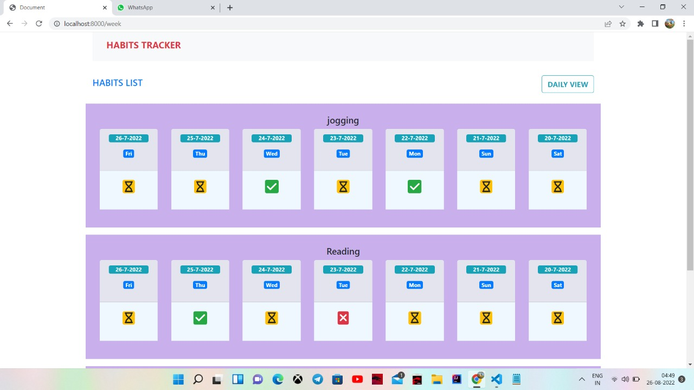
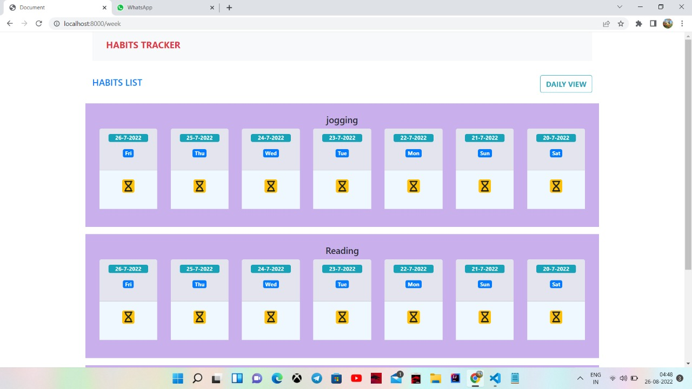
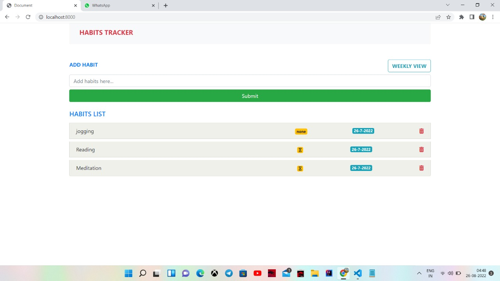
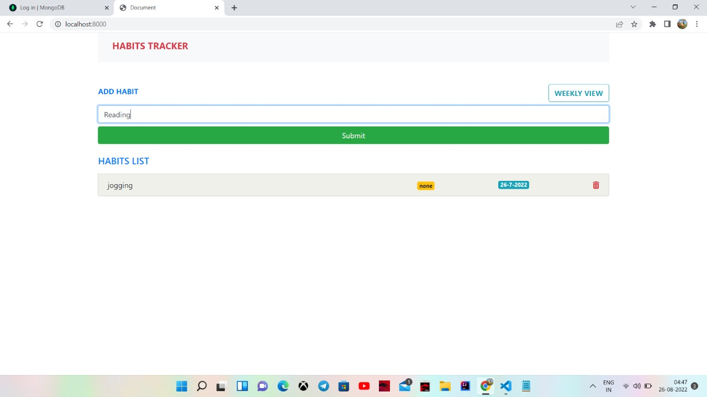

This is a simple habit tracker app
A user can sign in here and add new habit he want to maintain
and accordingly check his habit status for each day to different status done ,not done and pending.
A layout will show the days with status of habit of past 7 days and can change those days status also
Also can remove the habit and a user can add multiple habit.

Tech Stack: Nodejs,Mongoodb,Ejs,Bootstrap
github link: https://github.com/SumanJha2000/HabitTracker
video link:https://youtu.be/TQ_pOdn9_tY

